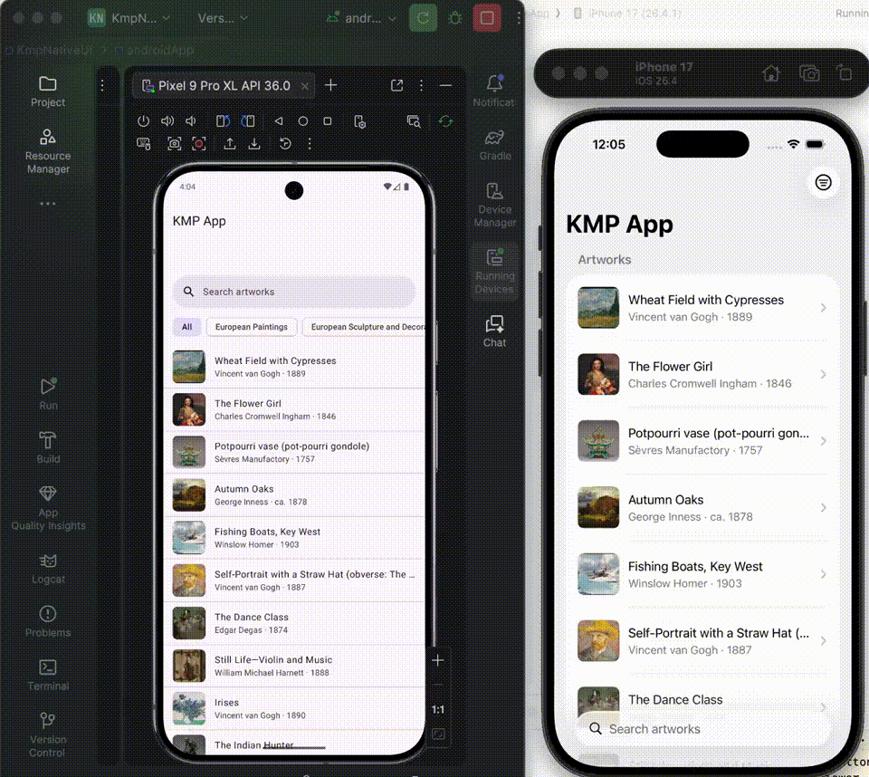

# KmpNativeUi

Kotlin Multiplatform project for **Android** and **iOS** with **native UI on each platform**.

## Demo



[Full demo video (MP4)](docs/kmp-app-native-ui-demo.mp4)

Shared Kotlin handles business logic, networking, and ViewModels. Each platform owns its UI and intentionally uses different platform patterns:

| | Android (Material 3) | iOS (SwiftUI / HIG) |
|---|---|---|
| List | `LazyColumn` + `ListItem` rows | Inset-grouped `List` |
| Search | Material `SearchBar` | `.searchable` |
| Filters | `FilterChip` row | Toolbar `Menu` |
| Detail | Cards + **FAB** favorite | `Form` + toolbar heart + `Toggle` |

Based on JetBrains’ [KMP-App-Template-Native](https://github.com/Kotlin/KMP-App-Template-Native). Sample screens load art from the [Met Museum API](https://metmuseum.github.io/).

## Structure

```
KmpNativeUi/
├── shared/       # KMP library: commonMain + androidMain + iosMain
├── androidApp/   # Android application (Compose / Material UI)
└── iosApp/       # Xcode project (SwiftUI UI)
```

## Run

**Android** (Android Studio or CLI):

```bash
./gradlew :androidApp:assembleDebug
```

**iOS** (macOS + Xcode): open `iosApp/iosApp.xcodeproj` and run. Xcode builds the `Shared` framework via Gradle before compiling Swift.
